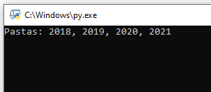
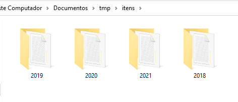
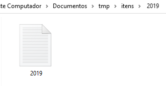

# Multiple Folders Python
 
*Programa em python para criar múltiplas pastas e arquivos de texto*

## Objetivo

Criei este programa pois frequentemente preciso criar várias pastas com arquivos de texto em cada uma delas.

## Screenshots

**Inserção dos nomes das pastas desejadas**  

**Pastas criadas**  

**Arquivo txt criado**  

